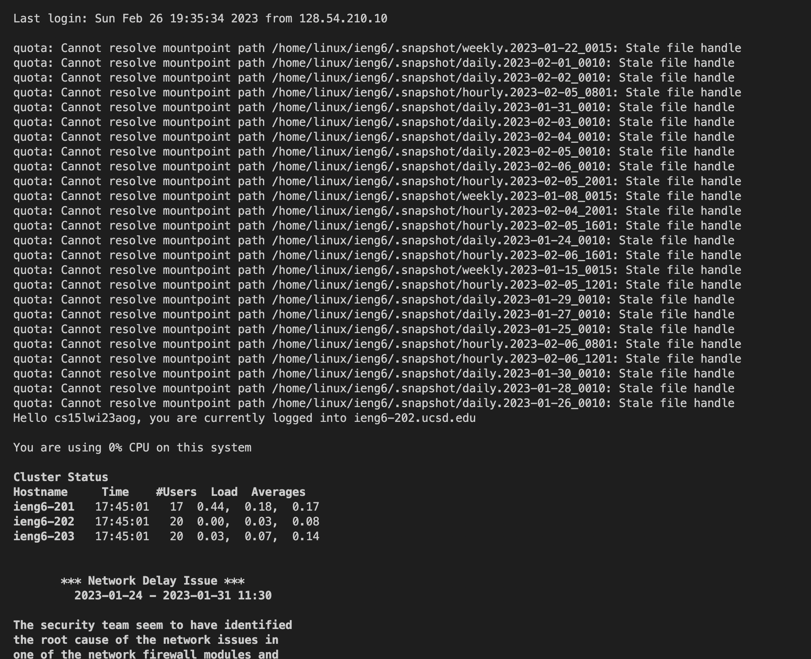
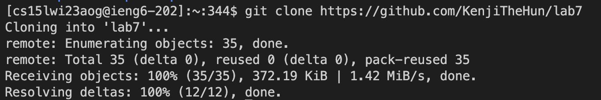
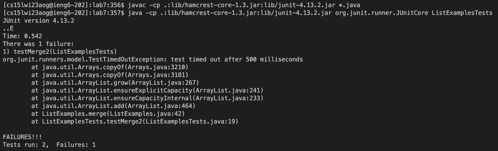
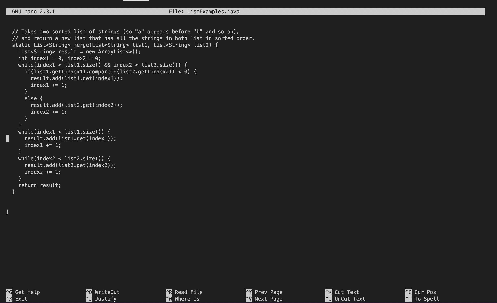
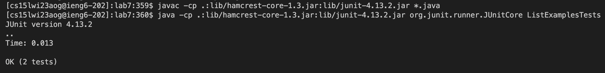
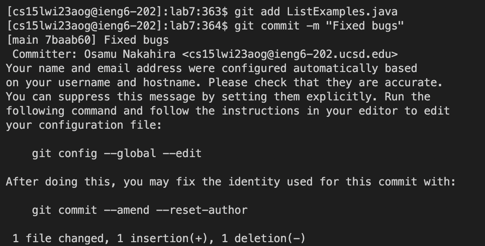
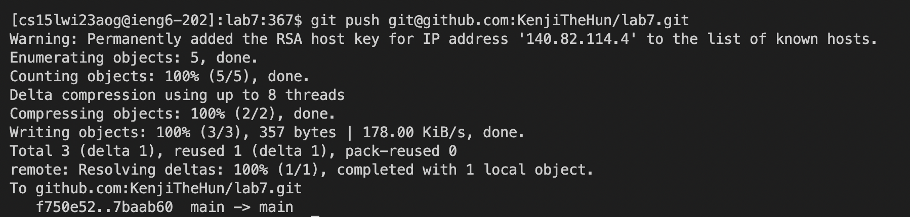

# Lab Report 4 - Challenge Tasks (Week 7)
## Step 1 - Log in to ieng6
Keys pressed: `<Ctrl-R><ssh><Enter>`

The `ssh cs15lwi23aog@ieng6.ucsd.edu` command was pretty far up in my bash history so I used the Ctrl-R to access the history and search for the command through `ssh` and pressed `Enter` to log in.

## Step 2 - Clone your fork of the repository from your Github account
Keys pressed: `<git clone><Ctrl-V><Enter>`

The `git clone` command could not be simplified using Tabs or bash history so I had to mannually enter the command and Copy-and-Paste the GitHub repo URL into the terminal.

## Step 3 - Run the tests, demonstrating that they fail
Keys pressed: `<Ctrl-R><javac><Enter>` `<Ctrl-R><java><Space><Tab>`

The `javac -cp .:lib/hamcrest-core-1.3.jar:lib/junit-4.13.2.jar *.java` command too far up in the bash history so I used Ctrl-R to access the history and typed in `javac` to find the compile command. Then the `java -cp .:lib/hamcrest-core-1.3.jar:lib/junit-4.13.2.jar org.junit.runner.JUnitCore` command was also far up in the history so I used Ctrl-R to access the history and typed in `java <Space>` to find and execute the run command.

## Step 4 - Edit the code file to fix the failing test
Keys pressed: `<Ctrl-R><nano><Enter>` `<Ctrl-O><Enter><Ctrl-X>`

The `nano ListExamples.java` command was used by me before so I simply used Ctrl-R to find the command and entered into the editing screen. As I already knew where the errors was located, I simply used Ctrl-W and typed `index1 += 1` to find the bug.
After I found the error, which was changing an index1 to index2, I pressed Ctrl-O then Enter to save the change and pressed Ctrl-X to exit out of the screen.

## Step 5 - Run the tests, demonstrating that they now succeed
Keys pressed: `<up><up><up><Enter>``<up><up><up><up><Enter>`

The `javac -cp .:lib/hamcrest-core-1.3.jar:lib/junit-4.13.2.jar *.java` and `java -cp .:lib/hamcrest-core-1.3.jar:lib/junit-4.13.2.jar org.junit.runner.JUnitCore` command was already used in Step 3 so I just pressed the up key 3 and 4 times respectively to run the tests again.

## Step 6 - Commit and push the resulting change to your Github account
Keys pressed: `<git add><L><Tab><.java><Enter>` `<Ctrl-R><git co><Enter>` `<git push> <Ctrl-V>`

The git commands were fairly easy to type in, besides commit which I forgot and used Ctrl-R to find. For git push, I copied the ssh URL so to avoid typing in my username and password for GitHub.

